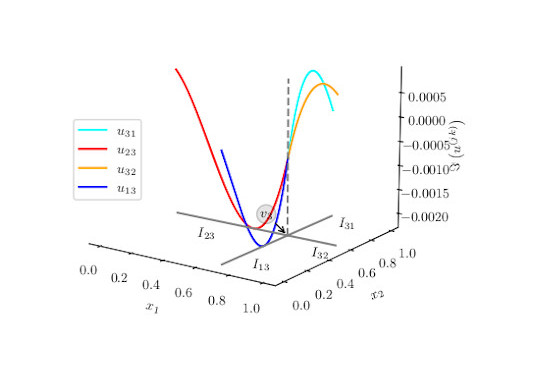
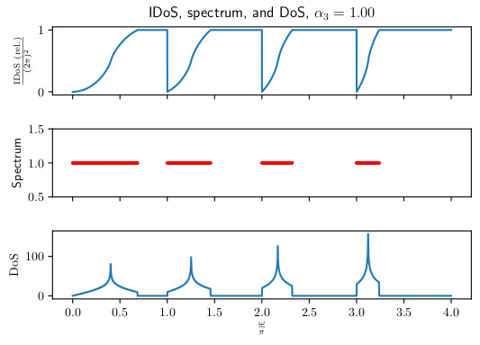

My PhD research focused on the analysis of differential systems on singular structures; regions that have no area from the perspective of the space they are embedded in.
Think of lines viewed in two dimensions, or a collection of planes in three dimensions.
Such structures can serve as approximations to the thin structures used as waveguides with applications in photonics and optical fibre technology.
We can visualise the thickness of a "thin" structure going to zero, resulting in a "singular" structure as illustrated in the image below.

{:class="text-centre"}

By looking for methods to postulate and solve these differential systems on singular structures, we may gain insight into how the geometry of a material affects its wave guidance properties.
We can also then look to extract information about the solutions (waves) on these singular structures, as well as the frequencies and band-gaps that our "singular" material supports.

{:style="width: 45%; text-align: left"}
{:style="width: 45%; text-align: right"}

This information can then be interpreted as "close to" that which we would get for the corresponding thin material we started with originally.

My supervisors for the project were [Prof. Kirill Cherednichenko]({{ page.thesis.kirill }}){:target="_blank"} and [Prof. David Bird]({{ page.thesis.david-bird }}){:target="_blank"}.

## Research Outputs

### Thesis

You can take a look through my thesis by heading over to the [University of Bath's research portal]({{ page.thesis.host }}){:target="_blank"} and [downloading a copy]({{ page.thesis.download}}){:target="_blank"}.
Alternatively, you can try [building it from source](https://github.com/willGraham01/PhD-Thesis){:target="_blank"} by heading to the repository containing it.
Or you can head over to that repository to poach a bunch of TikZ diagrams, whatever floats your boat.

You can also inspect the (not very high quality) code that I used to produce the numerical results that populate my thesis by heading to the [relevant Github repository]({{ page.thesis.code-repo }}){:target="_blank"}.

### <i class="fa fa-slideshare fa-fw w3-margin-right w3-xxlarge" id="Talks"></i> Seminars and Talks

#### Photonic Fibres from Thin Structures

- [BUC-XVI]({{ page.talks.photonic-fibres-thin-structures.buc-xvi }}){:target="_blank"}, <i class="fa fa-calendar fa-fw w3-margin"></i> Sept. 2019
- [Asymptotics, Operators, and Functionals]({{ page.talks.photonic-fibres-thin-structures.aoop }}){:target="_blank"}, <i class="fa fa-calendar fa-fw w3-margin"></i>Oct. 2019
- [Applied and Interdisciplinary Seminar (AIMS)]({{ page.talks.photonic-fibres-thin-structures.aims }}){:target="_blank"}, <i class="fa fa-calendar fa-fw w3-margin"></i>Feb. 2021

Photonic crystals can be thought of as thin, periodic structures that have found applications in the design of waveguides.
This is primarily because the geometry of these crystal structures gives rise to "frequency band gaps" - ranges of frequencies that cannot support wave propagation in the crystal - meaning one can use the crystal as a cladding for another material that does support waves at those frequencies.
However, determining the manner in which the crystal's geometry influences these "band gaps" is difficult - as one is typically looking at analysing Maxwell's equations on a geometrically complex and thin domain to find them.
This begs the question; since the crystal structure is typically thin, would it be unreasonable to approximate the structure as singular (having a thickness of zero)?
Doing so means we can borrow ideas from the theory of Quantum Graphs, essentially a framework for differential equations on graph-like structures, obtaining something that's easier to deal with than a system of PDEs (like Maxwell).
In this talk I will discuss the treatment of these "singular-structures" motivated by photonic crystals, the Quantum Graph problems that they lead us to, and the tools we can employ to handle them.
We will see that the Quantum Graph problems we obtain explicitly encode the geometry of the structure; and give us access to a tool that allows us (both analytically and numerically) to obtain information about the "band-gaps" of these structures.

### Adjacent Publications

#### Frequency-dependent impedance and surface waves on the boundary of a stratified dielectric medium

- <i class="fa fa-user-friends fa-fw w3-margin-right"></i> With Kirill Cherednichenko
- <i class="fa fa-link fa-fw w3-margin-right"></i> [PTRS Open Access]({{ page.publications.leontovich.published }}){:target="_blank"}
- <i class="fa fa-link fa-fw w3-margin-right"></i> [arXiv]({{ page.publications.leontovich.arxiv }}){:target="_blank"}

## Funding

I was supported by a scholarship from the EPSRC Centre for Doctoral Training in Statistical Applied Mathematics at Bath (SAMBa), under the project EP/L015684/1.
